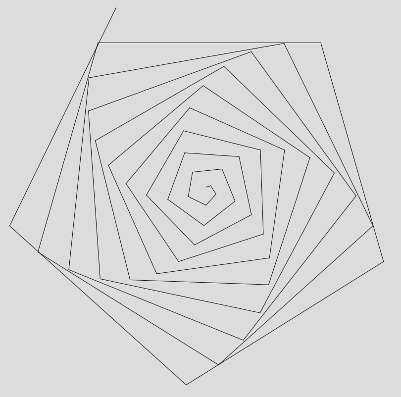
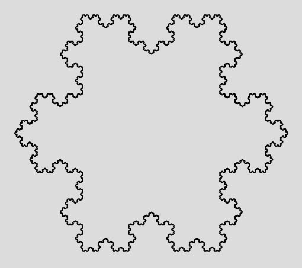

# Make a turtle!

The first thing on Papert and Solomon's [-@papert1971twenty] list of
twenty things is make a turtle. Over the intervening fifty years the
programmable turtle has featured as many young people's first
introduction to programming, both on the floor and on the screen. It
still has much to commend it: it is simple enough for children to grasp
the basic idea of the robot's operation - it moves forwards or
backwards; it turns to the left or to the right; it can draw, or not
draw, as it moves. The hardware itself is simple enough too: motors for
each of the main wheels, able to turn indepedendently, and a pen that
can be raised or lowered that fits right in the middle of these wheels:
as a 'notional machine' [@du1981black], it seems much easier for a child
to grasp conceptually than a smartphone, a tablet or a distant website.
It is also a friendly sort of thing: it is neither too big, nor too
small; it often develops some sort of character, at least in the child's
eyes; and, crucially, the child can put herself in the turtle's place.
The humble turtle is capable of great things, and many realise they can
move on from drawing regular polygons or simple pictures to stunning,
complex geometric figures.

## Turtles all the way down

Often a child's first experience of programming, even if it's not called
that at the time, is with some sort of floor robot, such as Bee-Bot®.
Whislt not a true Logo turtle, this can be given a sequence of move and
turn instructions, and even very young children quickly figure out for
themselves what it can, and cannot, do. More sophisticated floor turtles
can be found, such as Pro-Bot® and InO-Bot, both of which are 'proper'
turtles in the sense of being able to draw: the former can be programmed
using buttons on the device in a crude version of Logo, the latter on
screen using a building-block language inspired by Scratch. These
devices seem rather less popular than Bee-Bot® itself, perhaps because
of additional expense or because teachers think that when a pupil is
ready to move on from the Bee-Bot®, they're ready to move on to Scratch.

Scratch takes Logo turtles as a starting point, sprites in Scratch can
move and turn just as turltes do; they can also say things, play sounds,
change their appearance, interact with other sprites, respond to
external events and do lots of things that floor turtles can't. However,
in the current version of Scratch they can only draw using an additional
library of 'pen' commands, and they are confined to the world of the
screen.

Sooner, or hopefully later, the young programmer moves on from
block-based programming in Scratch or a similar environment, to
text-based programming, perhaps using a Logo interpreter here to help
bridge this gap, or perhaps jumping straight in to Python programming.
Even here though a good teacher might scaffold the transition to the
additional cognitive load of text-based programming through working in
the familiar territory of turtle graphics importing the necessary
methods from Python's Turtle module. This is a sophisticated toolkit,
and there are some lovely examples available, such as a playable, but
unbeatable, version of Nim, arguably the first ever computer game
[@flesch1951art].

However, in all these instances, from toy robots through to programming
in Python, the child never *builds* a turtle: they just use one, either
on the floor or on screen, built by the experts. Back in 1971, I think
Papert and Solomon had in mind something a little more visceral. How
might we replicate this today?

## Physical computing

As well as the on-screen programming, many have argued for some sort of
physical computing to go with this: providing some introduction to input
and output beyond mouse, keyboard, and screen, touch or otherwise. LEGO®
Mindstorms® named after Papert's (1980) book, [@bumgardner2007origins],
offers one possibility here. Whilst the step-by-step build instructions
for a floor turtle are not included in the standard materials, a 'master
builder' would be able to figure these out for herself. For others,
@astolfo2007building, provides an outline of what's needed.

Another approach might be to make use of a micro:bit as the brains for a
floor turtle, using the edge connector to link this to a powered control
board for motors. There are kits to make something like this using a
micro:bit readily available. On the other hand, with a few bits of
hardware and some ingenuity, this approach comes close to Papert and
Solomon's idea of building ones own turtle.

## Processing

Another approach to making a turtle would be to reinterpret this as
making a *virtual* rather than physical turtle - adding at least some of
the turtle graphics commands to a language which doesn't have these
already, such as Processing.

Processing began back in 2001, thirty years on from Papert and Solomon's
paper, and took some inspiration from Logo, as a visually expressive
language, and one suitable as a first programming langauge. Processing
offers a way of using code to create beautiful visual and interactive
media, as well as modelling applications. Originally developed in Java,
it can usefully be seen as an introduction to programming in that
language, doing lots of the heavy lifting needed to get something
interesting up on screen whilst still scaffolding the syntax and
approaches. There's also a Python syntax version, but much of the most
recent development work has happened in the native Javascript version,
p5.js. For those working in schools this has the huge advantage of not
needing anything installed locally: there's an editor right there in the
browser, as well as the storage and persistent URLs needed for folks to
share their programs ('sketches' in the processing jargon) with a global
audience. One reason that Processing, particularly in its p5.js
incarnation works well as an introductory text-based language is that it
provides some immediate motivation for moving on from Scratch: it's hard
to persuade pupils who've created games, animations and music in Scratch
of the value to be found in searching through or sorting arbtirary lists
in Python, but much easier to convince them that it's worth learning the
syntax to create an amazing generative animation in p5.js.

Whilst Processing is designed with graphics in mind, out of the box it
has no implementation of Logo's turtle, but rather adopts an entirely
Cartesian model of the canvas: if you want to program a turtle in
Processing, you have to make one.

## Turtles as objects

To me, the most natural way to make a turtle in Processing is as an
object: the turtle has properties (its position on the screen, its
heading, whether the pen is up or down, perhaps the colour and thickness
of the line drawn), and methods (moving forward, backward, turning left
or right, picking the pen up, putting the pen down, heading home,
perhaps even reporting where it is and where it's headed).

The turtle then becomes not merely an object to think with for geometry,
but an introduction to object oriented programming, and a reference
object for thinking about some of these, often quite subtle, ideas.

Here's one attempt at defining a class of turtles, and constructing a
new object in the class, right at the centre of the canvas:

``` {.javascript}
class Turtle {

constructor(x_ = width / 2, 
            y_ = height / 2, 
            direction_ = -90, 
            penDown_ = true, 
            penColor_ = color(0)) {
    this.x = x_;
    this.y = y_;
    this.direction = direction_;
    this.penDown = penDown_;
    this.penColor = penColor_;
    }
//...    
}
```

We might then go ahead and start adding some methods, starting with
moving forward. As we're having to conver from the turlte-centric polar
frame to the canvas's Cartesian frame, the math here is high school, but
then so is object oriented, text-based programming.

``` {.javascript}
    forward(d) {
        let oldX = this.x;
        let oldY = this.y;
        this.x += d * cos(this.direction);
        this.y += d * sin(this.direction);
        if (this.penDown) {
            stroke(this.penColor);
            line(oldX, oldY, this.x, this.y);
        }
    }
```

Turning right and left though are just changes in the turtle's
direction:

``` {.javascript}
    right(a) {
        this.direction += a;
    }

    left(a) {
        this.direction -= a;
    }
```

Similarly, pen up and pen down instructions simply change the value of
the turtle's penDown parameter:

``` {.javascript}
    pendown() {
        this.penDown = True;
    }

    penup() {
        this.penDown = False;
    }
```

Once all the necessary methods have been created, it's time to put this
to the test. The code here, ran once as part of p5.js's setup procedure
draws a regular pentagon, as expected. You can see the code borrowed
from Logo and that from native Javascript:

``` {.javascript}
function setup() {
  createCanvas(windowWidth, windowHeight);
  angleMode(DEGREES);
  background(220);
  ted = new Turtle();
  var i;
  for (i = 0; i < 5; i++) {
    ted.forward(200);
    ted.right(72);
  }
}
```

More interesting examples might be experiments with Papert's notion of
the 'squiral' [@papert1980mindstorms, 73]:

``` {.javascript}
function setup() {
  createCanvas(windowWidth, windowHeight);
  angleMode(DEGREES);
  background(220);
  ted = new Turtle();
  var i;
  for (i = 0; i < 50; i++) {
    ted.forward(10*i);
    ted.right(74);
  }
}
```

Which produces the following:



Or, we can go further still, and implement recursion to create a
fractal, such as the Koch Flake [@koch1904courbe].

``` {.javascript}
function setup() {
  createCanvas(windowWidth, windowHeight);
  angleMode(DEGREES);
  background(220);
  ted = new Turtle();
  for (i=0; i<3; i++) {
    edge(400);
    ted.right(120);
  }
}

function edge(size) {
  if (size < 1) {
    ted.forward(size);
  } else {
    edge(size / 3);
    ted.left(60);
    edge(size / 3);
    ted.right(120);
    edge(size / 3);
    ted.left(60);
    edge(size / 3);
  }
}
```



There is, of course, plenty more that can be done in turtle graphics,
and Processing itself. I have shared [my turtle class and an example
sketch] online for the reader to extend further.

What we have though is using Papert and Solomon's old idea of *making* a
turtle as a way in to understand some far deeper ideas than just
learning about exterior angles of polygons or making pretty patterns on
screen. *Making* a turtle crosses an abstraction boundary into hardware,
or at the very least, objects, properties and methods, all the while
staying within reach of the familiar home ground of the turtle itself.

The above was originally published as Berry, M., 2021, Make a Turtle! in [*Twenty Things to Do with a Computer Forward 50: Future Visions of Education Inspired by Seymour Papert and Cynthia Solomon's Seminal Work*](https://www.amazon.co.uk/Twenty-Things-Computer-Forward-Education/dp/1955604002/). Stager, G. (ed.). Torrance, CA: Constructing Modern Knowledge Press, p. 231-235 5 p.

# References


<style xmlns="http://purl.org/net/xbiblio/csl" class="in-text" version="1.0" demote-non-dropping-particle="sort-only" default-locale="en-GB">
  <info>
    <title>University of Birmingham - Harvard</title>
    <id>http://www.zotero.org/styles/harvard-university-of-birmingham</id>
    <link href="http://www.zotero.org/styles/harvard-university-of-birmingham" rel="self"/>
    <link href="https://intranet.birmingham.ac.uk/as/libraryservices/icite/referencing/harvard/index.aspx" rel="documentation"/>
    <link href="http://www.oak-wood.co.uk/oss/birmingham-harvard-csl" rel="documentation"/>
    <author>
      <name>Chris Hastie</name>
      <uri>http://www.oak-wood.co.uk</uri>
    </author>
    <category citation-format="author-date"/>
    <category field="generic-base"/>
    <summary>The Harvard author-date style - adapted for the University of Birmingham. See usage notes at http://www.oak-wood.co.uk/oss/birmingham-harvard-csl</summary>
    <updated>2018-02-25T05:13:48+00:00</updated>
    <rights license="http://creativecommons.org/licenses/by-sa/3.0/">This work is licensed under a Creative Commons Attribution-ShareAlike 3.0 License</rights>
  </info>
  <locale>
    <terms>
      <term name="open-quote">“</term>
      <term name="close-quote">”</term>
    </terms>
    <style-options punctuation-in-quote="true"/>
  </locale>
  <macro name="editor">
    <names variable="editor" delimiter=", ">
      <name name-as-sort-order="all" and="text" sort-separator=", " initialize-with="." delimiter-precedes-last="never" delimiter=", "/>
      <label form="short" prefix=" (" suffix=")" strip-periods="false"/>
    </names>
  </macro>
  <macro name="cite-editor">
    <names variable="editor" delimiter=", ">
      <name form="short" and="text" delimiter=", " delimiter-precedes-last="never" initialize-with=". "/>
    </names>
  </macro>
  <macro name="bookauthor">
    <names variable="container-author">
      <name name-as-sort-order="all" and="text" sort-separator=", " initialize-with="." delimiter-precedes-last="never" delimiter=", "/>
      <substitute>
        <text macro="editor"/>
      </substitute>
    </names>
  </macro>
  <!-- different to author because author will return a title for films and broadcasts -->
  <macro name="director">
    <names variable="author">
      <name name-as-sort-order="all" and="text" sort-separator=", " initialize-with="." delimiter-precedes-last="never" delimiter=", "/>
      <substitute>
        <text macro="editor"/>
      </substitute>
    </names>
  </macro>
  <macro name="author">
    <choose>
      <!--UoB requires title rather than author for videos, films and broadcasts -->
      <if type="broadcast motion_picture" match="any">
        <choose>
          <if variable="container-title">
            <text variable="container-title" font-style="italic"/>
          </if>
          <else-if variable="title">
            <text variable="title" font-style="italic"/>
          </else-if>
        </choose>
      </if>
      <else-if type="bill legislation" match="any">
        <text variable="title" font-style="italic"/>
      </else-if>
      <else>
        <names variable="author">
          <name name-as-sort-order="all" and="text" sort-separator=", " initialize-with="." delimiter-precedes-last="never" delimiter=", "/>
          <label form="short" prefix=" " strip-periods="false"/>
          <substitute>
            <text macro="editor"/>
            <!-- for anonymous works, use title -->
            <choose>
              <if type="webpage">
                <text variable="title" font-style="italic"/>
              </if>
              <else-if variable="container-title">
                <text variable="title" font-style="normal"/>
              </else-if>
              <else>
                <text variable="title" font-style="italic"/>
              </else>
            </choose>
          </substitute>
        </names>
      </else>
    </choose>
  </macro>
  <macro name="author-short">
    <choose>
      <if type="broadcast motion_picture" match="any">
        <choose>
          <if variable="container-title">
            <text variable="container-title"/>
          </if>
          <else-if variable="title">
            <text variable="title"/>
          </else-if>
        </choose>
      </if>
      <else-if type="bill legislation" match="any">
        <text variable="title"/>
      </else-if>
      <else>
        <names variable="author">
          <name form="short" and="text" delimiter=", " delimiter-precedes-last="never" initialize-with=". "/>
          <substitute>
            <text macro="cite-editor"/>
            <text variable="title"/>
            <names variable="translator"/>
          </substitute>
        </names>
      </else>
    </choose>
  </macro>
  <macro name="access">
    <choose>
      <if variable="DOI" match="none">
        <group delimiter=" ">
          <text variable="URL" prefix="Available at: "/>
          <choose>
            <if variable="URL">
              <group prefix=" (" suffix=")">
                <choose>
                  <if type="book chapter" match="any">
                    <text value="Downloaded: "/>
                  </if>
                  <else>
                    <text term="accessed" text-case="capitalize-first" suffix=": "/>
                  </else>
                </choose>
                <date variable="accessed">
                  <date-part name="day" suffix=" "/>
                  <date-part name="month" suffix=" "/>
                  <date-part name="year"/>
                </date>
              </group>
            </if>
          </choose>
        </group>
      </if>
      <else>
        <text variable="DOI" prefix="doi:"/>
      </else>
    </choose>
  </macro>
  <macro name="title">
    <choose>
      <!-- if anonymous, title will already have appeared at author position, so return nothing -->
      <if variable="author editor" match="any">
        <choose>
          <if type="bill book graphic legal_case legislation manuscript motion_picture report song webpage" match="any">
            <text variable="title" font-style="italic"/>
          </if>
          <else-if variable="container-title" match="none">
            <text variable="title" font-style="italic"/>
          </else-if>
          <else-if type="chapter paper-conference" match="any">
            <text variable="title" quotes="true"/>
          </else-if>
          <else>
            <text variable="title"/>
          </else>
        </choose>
      </if>
    </choose>
  </macro>
  <macro name="publisher">
    <group delimiter=": ">
      <text variable="publisher-place"/>
      <text variable="publisher"/>
    </group>
  </macro>
  <macro name="year-date">
    <choose>
      <if variable="issued">
        <date variable="issued">
          <date-part name="year"/>
        </date>
      </if>
      <else>
        <text term="no date" form="short"/>
      </else>
    </choose>
  </macro>
  <macro name="edition">
    <choose>
      <if is-numeric="edition">
        <group delimiter=" ">
          <number variable="edition" form="ordinal"/>
          <text term="edition" form="short" strip-periods="false"/>
        </group>
      </if>
      <else>
        <text variable="edition" suffix="."/>
      </else>
    </choose>
  </macro>
  <macro name="pages">
    <choose>
      <if type="article-journal article-magazine" match="any">
        <choose>
          <if variable="volume issue" match="any">
            <text variable="page"/>
          </if>
          <else>
            <label variable="page" form="short" suffix=" "/>
            <text variable="page"/>
          </else>
        </choose>
      </if>
      <else>
        <group>
          <label variable="page" form="short" suffix=" "/>
          <text variable="page"/>
        </group>
      </else>
    </choose>
  </macro>
  <macro name="volumes">
    <group>
      <text variable="number-of-volumes" suffix=" "/>
      <label variable="volume" form="short" plural="always"/>
    </group>
  </macro>
  <macro name="issued">
    <choose>
      <if type="article-newspaper article-magazine motion_picture paper-conference broadcast" match="any">
        <date variable="issued">
          <date-part name="day" suffix=" "/>
          <date-part name="month"/>
        </date>
      </if>
    </choose>
    <choose>
      <if type="motion_picture broadcast paper-conference" match="any">
        <date variable="issued">
          <date-part name="year" prefix=" "/>
        </date>
      </if>
    </choose>
  </macro>
  <citation et-al-min="3" et-al-use-first="1" disambiguate-add-year-suffix="true" collapse="year">
    <layout prefix="(" suffix=")" delimiter="; ">
      <group delimiter=", ">
        <text macro="author-short"/>
        <choose>
          <if type="bill legislation" match="none">
            <text macro="year-date"/>
          </if>
        </choose>
        <group>
          <label variable="locator" form="short" strip-periods="false"/>
          <text variable="locator"/>
        </group>
      </group>
    </layout>
  </citation>
  <bibliography hanging-indent="false" et-al-min="4" et-al-use-first="3">
    <sort>
      <key macro="author"/>
      <key macro="year-date" sort="ascending"/>
      <key variable="title"/>
    </sort>
    <layout suffix=".">
      <group delimiter=" ">
        <choose>
          <if type="bill legislation" match="any">
            <text macro="author" suffix=". "/>
          </if>
          <else>
            <text macro="author"/>
            <choose>
              <if variable="author editor" match="any">
                <text macro="year-date" prefix=" (" suffix=")"/>
              </if>
              <else-if type="broadcast motion_picture" match="any">
                <text macro="year-date" prefix=" (" suffix=")"/>
              </else-if>
              <else>
                <text macro="year-date" prefix=" (" suffix=")."/>
              </else>
            </choose>
          </else>
        </choose>
        <group delimiter=". ">
          <choose>
            <if type="bill legislation" match="any">
              <group delimiter=". ">
                <text variable="container-title" font-style="italic"/>
                <text macro="edition"/>
                <text macro="editor"/>
                <text variable="number" suffix=")" prefix="("/>
                <text variable="note"/>
              </group>
            </if>
            <else-if type="thesis">
              <group delimiter=". ">
                <group prefix=" " delimiter=" ">
                  <text macro="title" font-style="italic"/>
                  <text macro="edition"/>
                </group>
                <group prefix=" " delimiter=", ">
                  <text variable="genre"/>
                  <text variable="publisher"/>
                </group>
              </group>
            </else-if>
            <else-if type="webpage">
              <group prefix=" " delimiter=" ">
                <text macro="title"/>
                <text macro="edition"/>
              </group>
            </else-if>
            <else-if type="manuscript">
              <group delimiter=". ">
                <group delimiter=" ">
                  <text macro="title"/>
                  <text variable="genre" prefix="[" suffix="]"/>
                </group>
                <text variable="archive"/>
                <text variable="archive_location"/>
                <text macro="publisher"/>
              </group>
            </else-if>
            <else-if type="article-journal article-magazine article-newspaper interview map patent personal_communication song speech" match="any">
              <group>
                <group suffix=".">
                  <text macro="title" prefix=" "/>
                  <text macro="editor" prefix=" "/>
                </group>
                <group delimiter=" " prefix=" ">
                  <text variable="container-title" font-style="italic"/>
                </group>
                <group prefix=", " delimiter=", ">
                  <text macro="issued"/>
                  <group delimiter=": ">
                    <group delimiter=" ">
                      <text variable="volume"/>
                      <text variable="issue" prefix="(" suffix=")"/>
                    </group>
                    <text macro="pages"/>
                  </group>
                </group>
              </group>
            </else-if>
            <else-if type="broadcast motion_picture" match="any">
              <group delimiter=". ">
                <group delimiter=", ">
                  <text variable="number"/>
                  <choose>
                    <if variable="container-title">
                      <text variable="title"/>
                    </if>
                  </choose>
                </group>
                <group delimiter=" ">
                  <choose>
                    <if type="motion_picture" match="any">
                      <text value="Film"/>
                    </if>
                  </choose>
                </group>
                <group delimiter=". ">
                  <text macro="director"/>
                  <text macro="publisher"/>
                  <text macro="issued"/>
                </group>
              </group>
            </else-if>
            <else-if type="bill book graphic legal_case report" match="any">
              <group delimiter=". ">
                <group prefix=" ">
                  <text macro="title"/>
                  <group delimiter=" " prefix=". ">
                    <text variable="collection-title"/>
                    <text variable="collection-number"/>
                    <text variable="number"/>
                  </group>
                  <group delimiter=". " prefix=". ">
                    <text macro="volumes"/>
                    <text macro="edition"/>
                    <text macro="editor"/>
                  </group>
                </group>
                <text macro="publisher" prefix=" "/>
                <text variable="note" suffix=")" prefix="("/>
              </group>
            </else-if>
            <else-if type="chapter" match="any">
              <group>
                <text macro="title" prefix=" " suffix="."/>
                <group prefix=" " delimiter=" ">
                  <text term="in" text-case="capitalize-first" suffix=" " text-decoration="underline"/>
                  <text macro="bookauthor"/>
                  <group prefix=" " suffix=".">
                    <text variable="container-title" font-style="italic"/>
                    <group delimiter=" " prefix=". ">
                      <text variable="collection-title"/>
                      <text variable="collection-number"/>
                      <text variable="number"/>
                    </group>
                    <group delimiter=". " prefix=". ">
                      <text macro="volumes"/>
                      <text macro="edition"/>
                    </group>
                  </group>
                  <group delimiter=". ">
                    <text macro="issued"/>
                    <text macro="publisher"/>
                    <text macro="pages"/>
                  </group>
                </group>
              </group>
            </else-if>
            <else-if type="paper-conference" match="any">
              <group>
                <text macro="title" prefix=" " suffix="."/>
                <group delimiter=". ">
                  <group prefix=" " delimiter=" ">
                    <text term="in" text-case="capitalize-first" suffix=" " text-decoration="underline"/>
                    <text macro="editor" suffix="."/>
                    <text variable="container-title" font-style="italic" suffix="."/>
                    <text variable="collection-title"/>
                    <group delimiter=", ">
                      <text variable="publisher-place"/>
                      <text macro="issued"/>
                    </group>
                  </group>
                  <group delimiter=". ">
                    <text variable="publisher"/>
                    <text macro="pages"/>
                  </group>
                </group>
              </group>
            </else-if>
            <else>
              <group delimiter=". ">
                <group>
                  <text macro="title" prefix=" "/>
                  <text macro="editor" prefix=" "/>
                </group>
                <group delimiter=" ">
                  <text variable="container-title" font-style="italic"/>
                </group>
                <group prefix=" ">
                  <group prefix=" ">
                    <text variable="volume"/>
                    <text variable="issue" prefix=" (" suffix=")"/>
                    <text macro="issued"/>
                  </group>
                  <group prefix=" ">
                    <text macro="pages"/>
                  </group>
                </group>
              </group>
            </else>
          </choose>
          <text prefix=" " macro="access"/>
        </group>
      </group>
    </layout>
  </bibliography>
</style>
